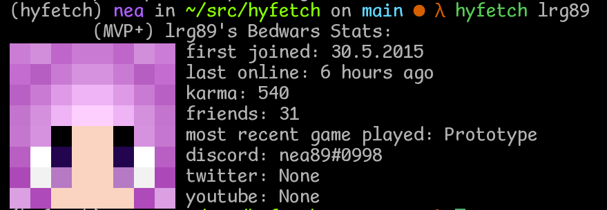
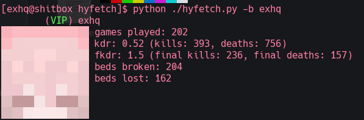
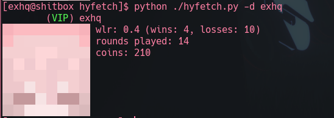

# Hyfetch - Hypixel in your Terminal

Currently, in a sort of beta 0.1: It's usable, but expect shit to change.

  
  
  

## Installation

While we are in the beta, it is better to use `pip install https://github.com/echothegoddess/hyfetch/archive/master.zip`
directly, instead of relying on pypi.

## Supported game modes

<!-- TODO: Screenshots for all stat pages -->

 - General Stats
 - Bedwars
 - Skywars
 - TODO: Skyblock
